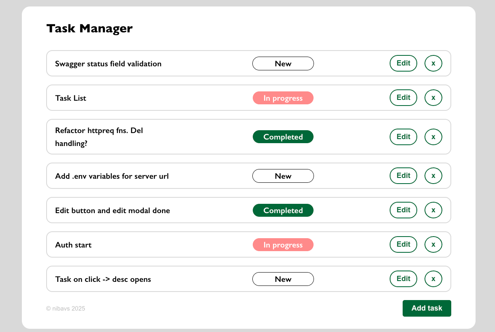

# Task Manager ✏️📃

## Description
This project is a task management application that allows users to add, delete, edit, and view tasks stored in a database. Each task has a status and a title. The application is built using Vue.js for the frontend, Spring Boot for the backend, and MySQL as the database. Additionally, Swagger has been used to generate API documentation for the backend. Auth feature is added to the main functionality. It allows user to sign in / sign up and work with particular tasks.

## UI view
- Auth window
  


- Main window
  


- Edit task modal window
  


## Technologies Used

- **Frontend:**
  - Vue3.js
  - Pinia 
  - TypeScript
  - Vue Router

- **Backend:**
  - Spring Boot
  - Spring Data JPA
  - Spring Security
  - JWT token 
  - Swagger 
  - Maven 

- **Database:**
  - MySQL

## Features

- Add new tasks with a title and status
- Edit existing tasks
- Delete tasks from the database
- View all tasks stored in the system
- API documentation generated with Swagger
- State management with Pinia
- Routing implemented with Vue Router
- Auth to the system

## Installation and Running

1. Clone the repository:
   ```bash
   git clone https://github.com/nibavs/task-manager.git
2. Make sure you have Java 11+, Maven for server and Node.js for client installed
3. Create a .env file in the client folder of the project and define the server parameters:
   ```bash
   VITE_API_BASE_URL="your_server_url_here"
   VITE_API_TASKS_ENPOINT="your_server_url_here/tasks"
   VITE_API_SIGN_IN_ENPOINT="your_server_url_here/signIn"
   VITE_API_SIGN_UP_ENPOINT="your_server_url_here/signUp"
4. Add environment variables for server:
   ```bash
   DB_URL="your_db_url"
   DB_USERNAME="your_db_username"
   DB_PASSWORD="your_db-password"
   SECRET_KEY="your_secret_fkey"

5. Run the server using Maven in the server directory:
   ```bash
   mvn spring-boot:run
6. Run the client using NPM in the client directory:
   ```bash
   npm run dev
7. To make the application work, you will need a configured MySQL database with the following table for tasks:
   ```bash
   CREATE TABLE user (
      id INT AUTO_INCREMENT PRIMARY KEY,
      username VARCHAR(45) NOT NULL,
      password TEXT,
      created_at TIMESTAMP DEFAULT CURRENT_TIMESTAMP
   );

   CREATE TABLE task (
      id INT AUTO_INCREMENT PRIMARY KEY,
      title VARCHAR(255) NOT NULL,
      description TEXT,
      status VARCHAR(50) DEFAULT 'NEW',
      created_at TIMESTAMP DEFAULT CURRENT_TIMESTAMP,
      user_id INT,
      CONSTRAINT fk_task_user FOREIGN KEY (user_id) REFERENCES user(id) ON DELETE CASCADE
   );
